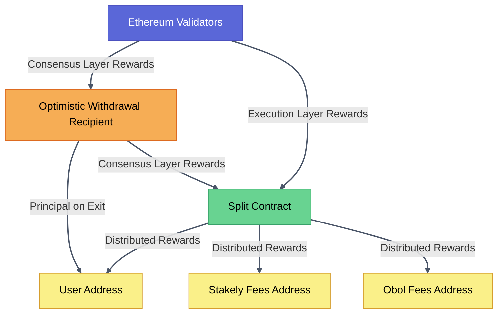

# Technical Architecture

The Obol Portal leverages a system of smart contracts and operational flows to ensure secure, efficient, and transparent staking operations. This section outlines the key components and processes that form the backbone of our technical architecture.

## Smart Contracts

The Obol Portal utilizes three primary smart contracts to manage deposits, withdrawals, and reward distribution:

### 1. Optimistic Withdrawal Recipient (OWR)

The OWR contract is a crucial component in managing consensus rewards and principal returns.

- **Purpose**: Manages the distribution of consensus rewards and the return of principal to the user.
- **Functionality**: 
  - Directs consensus rewards to a specified rewards address.
  - Returns the principal amount to the user's address.
  - Tracks ETH distributions and allocates funds based on predefined thresholds and the configured principal amount.
- **Creation**: Initiated by the user during the staking process.
- **Key Parameters**: Rewards address, principal address, and principal amount.
- **Simplified Distribution Logic**: 
  - If balance > 16 ETH: Distributes to principal address.
  - If balance < 16 ETH: Distributes to rewards address.

**Resources**: 
- [OWR Contract Repository](https://github.com/ObolNetwork/obol-splits)
- [OWR Documentation](https://docs.obol.org/docs/next/sc/introducing-obol-splits#withdrawal-recipients)

### 2. Splits Contract

The Splits contract manages the fair distribution of rewards among the entities.

- **Purpose**: Distributes execution and consensus rewards between the user, Obol, and Stakely.
- **Functionality**: 
  - Initially mutable to allow for pre-creation before cluster formation.
  - Becomes immutable after user deposit and user address configuration.
- **Lifecycle**:
  1. Pre-created before cluster formation.
  2. Edited to include user's reward address upon deposit.
  3. Transitions to an immutable state post-configuration.

**Resources**: [Splits Documentation](https://splits.org/)

### 3. Multicall3 Contract

Multicall3 is used to optimize contract interactions and improve user experience.

- **Purpose**: Simplifies operations, reduces gas costs, and enhances user experience.
- **Functionality**: Allows batching of multiple contract calls into a single transaction.

**Resources**: [Multicall3 Documentation](https://www.multicall3.com/)

## Contract Flow
This diagram tries to provide an accurate representation of reward and principal flows in the Obol Portal system.

## Operational Flow

The Obol Portal's operational flow can be divided into two main phases: Pre-user setup and User interactions.

### Pre-User Setup

1. **Create Splits**: 
   - Deploy the Splits contract for reward distribution. These deployments are the fist step of the process since these addresses are the `fee-recipient` of the validators. Obol clusters are not easily editable and that is why they should be configured at cluster creation.

2. **Create Cluster**: 
   - Create the Obol DVT cluster for validator operations. It will contain the Split contracts as the `fee-recipient`.

3. **Mapping**: 
   - Configure the relationship between splits and validators. This relationship is highly important since the correct Split contracts need to be edited when users deposit on validators, and because Obol clusters are not easily editable.

4. **Validator Groups**: 
   - Organize validators into predefined groups (1, 2, 5, 10, 100, 200). This associates the same `fee-recipient` to multiple validators, so if any user wants to deposit on more than one validators, it can do a single deposit, a single OWR deployment and a have a single Split.

### User Interactions

1. **Create OWR**: 
   - User deploys the Optimistic Withdrawal Recipient contract using the following parameters: principal amount (the number of ETH the user wants to stake), the principal address (the address where the user is going to receive the funds), and the split address (where the consensus rewards of the validator are going to be sent). This is all abstracted on the interface.

2. **Deposit ETH**: 
   - User performs the ETH deposit on the official Ethereum deposit contract, using the OWR as the withdrawal recipient address.

3. **Edit Split**: 
   - The Splits contract is updated with the user's reward address and made immutable. This process is automated and performed by Stakely.

4. **Claim Rewards**: 
   - User can claim accrued rewards at their discretion. The claim rewards function is a Multicall3 transaction batch that claims consensus rewards from the OWR and then consensus and execution rewards from the Split.

5. **Exit**: 
   - User can initiate the exit process to withdraw their principal. Since exits cannot be performed in the execution layer, a signature is asked to confirm that the user wants to initiate the exit.

## System Integration

The smart contracts, operational flows, and user interfaces work in concert to provide a seamless staking experience:

- The OWR contract serves as the primary point for ETH deposits and withdrawal management.
- The Splits contract ensures fair and transparent reward distribution among all parties.
- Multicall3 optimizes contract interactions, reducing complexity and gas costs for users.
- The pre-user setup phase prepares the infrastructure for efficient validator operations.
- User interactions are streamlined through the Obol Portal interface, abstracting the complexity of the underlying smart contract operations.

This architecture ensures that users maintain control of their funds while benefiting from the security and efficiency of Stakely's infrastructure and Obol's DVT technology.
