# Staking Flow

### Stake (delegation)

Staking on Cosmos Hub involves delegating ATOMs, the native cryptocurrency of the Cosmos network, to a validator. Validators participate in consensus and governance. By staking your ATOMs, you help secure the network and earn rewards.

    1. **Delegate Tokens**: Use the delegate function to allocate a specific amount of ATOMs to the chosen validator.
    2. **Transaction Confirmation**: Once submitted, the transaction will be validated and included in a block. You are now officially staking and will begin to accumulate rewards based on the validator's performance.

### Unstake (Undelegation)

Unstaking in Cosmos ecosystem is called undelegation. It is the process of withdrawing staked tokens from a validator, which is subject to an unbonding period.

    1. **Initiate Undelegation**: Use the undelegate function to start the process of withdrawing your staked ATOMs from the validator.
    2. **Unbonding Period**: Undelegated tokens are locked for a 21-day unbonding period, during which they do not earn rewards and cannot be transferred.
    3. **Completion**: After the unbonding period, tokens are automatically released and can be freely transferred or restaked.

### Claiming Rewards

Rewards generated from staking are not automatically added to your wallet; they must be claimed manually.

    1. **Check Accumulated Rewards**: Verify your accumulated rewards through the rewards function or just check an explorer.
    2. **Claim Rewards**: Use the `withdraw_rewards` function to transfer your accumulated staking rewards into your wallet.
    3. Reinvestment or Transfer: After claiming, rewards can be reinvested by staking them with a validator or used for other transactions.

# Staking API Diagram

```mermaid
sequenceDiagram
autonumber
actor User
participant Staking API
User->>+Staking API: Stake action
Note left of User: Offline: Stake 10 ATOM
Note right of Staking API: 🔨 Stake action crafting
Staking API-->>-User: Stake action return
activate User
rect rgb(255,178,216)
Note left of User: 📝 Sign unsigned transaction:
Note left of User:  a) Locally with private key 🔑
Note left of User:  b) Custodian 🏦
end
deactivate User

User->>+Staking API: Prepare
Note right of Staking API: 🔏  Adds signature to tx
Staking API-->>-User: Returns signed transaction
activate User
rect rgba(228, 173, 77, 0.8)
Note left of User: With the signed transaction you can:
Note left of User: Broadcast it by yourself using any RPC
Note left of User: Send it to the broadcast endpoint
end
deactivate User
User->>+Staking API: Broadcast
Note right of Staking API: 📡  Broadcast to the network
Staking API-->>-User: Returns broadcasted transaction status
activate User
rect rgba(50, 156, 0, 0.8)
Note left of User:  If success, transaction is already onchain! 🚀
end
deactivate User
```

