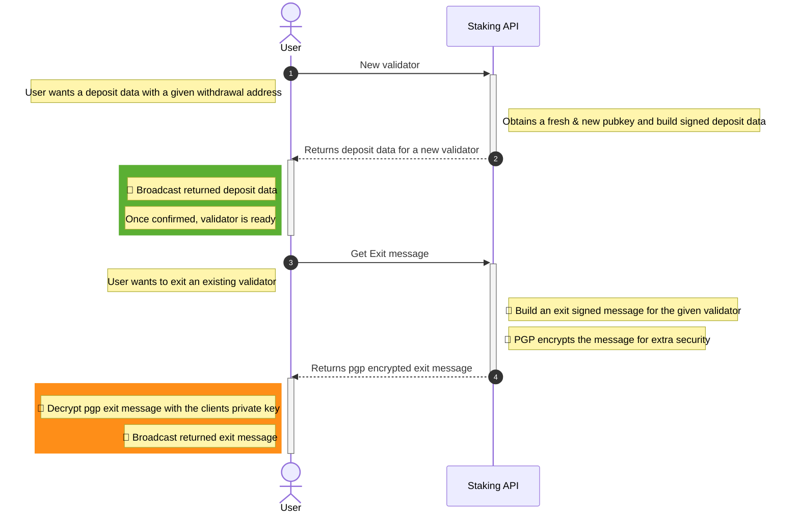

# Staking API Diagram

```mermaid
sequenceDiagram
autonumber
actor User
participant Staking API
User->>+Staking API: New validator
Note left of User: User wants a deposit data with a given withdrawal address
Note right of Staking API: Obtains a fresh & new pubkey and build signed deposit data
Staking API-->>-User: Returns deposit data for a new validator
activate User
rect rgba(50, 156, 0, 0.8)
Note left of User: 📡 Broadcast returned deposit data
Note left of User:  Once confirmed, validator is ready
end
deactivate User

User->>+Staking API: Get Exit message
Note left of User: User wants to exit an existing validator
Note right of Staking API: 🔨 Build an exit signed message for the given validator
Note right of Staking API: 🔏 PGP encrypts the message for extra security
Staking API-->>-User: Returns pgp encrypted exit message
activate User
rect rgb(254,142,24)
Note left of User:  🔑 Decrypt pgp exit message with the clients private key
Note left of User:  📡 Broadcast returned exit message
end
deactivate User
```
