# Staking Flow

Before interacting with the API methods, it is useful to understand how staking works conceptually in StakeWise.

StakeWise uses a **Vault-based staking model**. Users deposit ETH into a Vault, which manages validator participation on Ethereum. In return, users optionally receive liquid staking tokens (`osETH`) that represent their staked position while still allowing liquidity.
More information available on the official documentation: https://docs.stakewise.io/docs/vaults/how-vaults-work

### Stake

Staking in StakeWise consists of depositing ETH into a StakeWise Vault. The Vault manages validator registration and execution on behalf of stakers.

1. **Deposit ETH**: Use the `stake` method to deposit a specific amount of ETH into the chosen StakeWise Vault.
2. **Transaction Confirmation**: Once the transaction is confirmed on-chain, the ETH becomes part of the Vault’s staked balance.
3. **Reward Accrual**: Rewards accrue over time based on protocol conditions and validator performance, and are reflected proportionally in the liquid staking token holdings.

### Unstake

Unstaking begins the process of exiting part or all of the staked ETH from the Vault back to a withdrawable state.

1. **Initiate Unstake**: Use the `unstake` method to signal withdrawal of a specified amount of ETH from the Vault.
2. **Exit Queue & Processing**: The unstake request enters the Vault’s exit queue and is processed according to protocol rules. Users may need to wait as validator exits are fulfilled.
3. **Ready for Withdrawal**: Once the unstaking process completes and ETH is available in the Vault, it becomes withdrawable.

### Withdraw

After unstaking has processed and the ETH is available in the Vault, a separate action moves the funds back to the user’s wallet.

1. **Check Withdrawable Amount**: Verify how much ETH is available for withdrawal.
2. **Withdraw Funds**: Use the `withdraw` method to transfer the available ETH back into your wallet.
3. **Post-Withdrawal**: The withdrawn ETH can be used freely on-chain or restaked as desired.

## Staking API Diagram

```mermaid
sequenceDiagram
autonumber
actor User
participant Staking API
User->>+Staking API: Stake action
Note left of User: Offline: Stake 1 ETH
Note right of Staking API: 🔨 Stake action crafting
Staking API-->>-User: Stake action return
activate User
rect rgb(255,178,216)
Note left of User: 📝 Sign unsigned transaction:
Note left of User:  a) Locally with private key 🔑
Note left of User:  b) Custodian 🏦
end
deactivate User

User->>+Staking API: Prepare
Note right of Staking API: 🔏  Adds signature to tx
Staking API-->>-User: Returns signed transaction
activate User
rect rgba(228, 173, 77, 0.8)
Note left of User: With the signed transaction you can:
Note left of User: Broadcast it by yourself using any RPC
Note left of User: Send it to the broadcast endpoint
end
deactivate User
User->>+Staking API: Broadcast
Note right of Staking API: 📡  Broadcast to the network
Staking API-->>-User: Returns broadcasted transaction status
activate User
rect rgba(50, 156, 0, 0.8)
Note left of User:  If success, transaction is already onchain! 🚀
end
deactivate User
```

