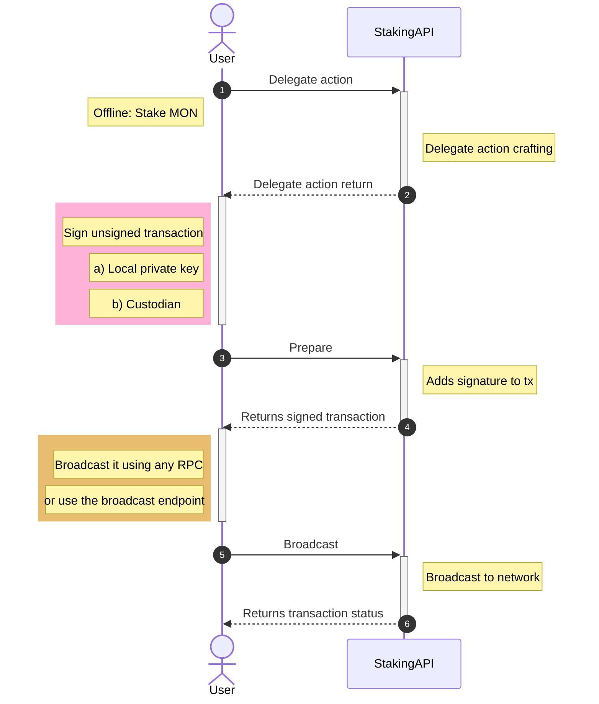

# Staking Flow

Before interacting with the API methods, it is useful to understand how Magma works on Monad.

Magma is a liquid staking protocol on Monad. Magma's staking pool allows users to stake Monad tokens and receive liquid staked Monad (`gMON`) in return.

Magma is built on Monad, an EVM L1 designed for high throughput, low costs, and censorship resistance. The protocol is operated in a decentralized way, with a strong focus on community participation and socially conscious decision-making.

## Liquid staking

Magma allows MON holders to generate staking rewards while remaining liquid. When users stake MON to participate in Monad's DPoS consensus, they receive `gMON`, which represents their staked MON and accrued staking position.

`gMON` can be used across DeFi applications in the Monad ecosystem for collateral, liquidity provision, lending and borrowing, and trading activities. `gMON` is designed as a fully collateralized asset, backed 1:1 and redeemable for MON.

## gVaults

Magma introduces staking vaults (`gVaults`) on Monad. This architecture is designed to isolate risks and provide stronger operational and regulatory flexibility for institutional users.

### Delegate

Delegation stakes MON into Magma and mints the liquid staking position.

1. **Initiate delegation**: Use the delegate action to craft a transaction with the amount you want to stake.
2. **Transaction confirmation**: Once confirmed on-chain, your MON is staked in Magma.
3. **Receive gMON**: Your liquid staking position is represented by `gMON`.

### Undelegate

Undelegation starts the process of exiting part of your staked position.

1. **Initiate undelegation**: Use the undelegate action for the amount you want to exit.
2. **Request creation**: The protocol creates a withdrawal request associated with a `request_id`.
3. **Wait period**: Funds become withdrawable after the protocol-defined unlock period.

### Withdraw

Once a withdrawal request is available, you can claim it.

1. **Check withdrawal status**: Retrieve your pending requests and identify a withdrawable `request_id`.
2. **Withdraw funds**: Use the withdraw action with that `request_id`.
3. **Post-withdrawal**: Claimed MON is returned to your wallet and can be reused or restaked.

___

## Staking API Diagram

