# Staking Flow

Before interacting with the API methods, it is useful to understand how native staking works on Monad.

Monad staking follows an EVM-compatible delegation model. A delegator assigns tokens to a validator, who participates in block production and network consensus. By delegating tokens, you help secure the network and earn staking rewards.

All staking operations are executed on-chain. The Stakely Staking API crafts the required transactions, while signing and broadcasting are handled by your application.

### Delegate

Delegation assigns a specified amount of tokens to a validator.

1. **Initiate Delegation**: Use the delegate action to create a transaction that delegates a chosen amount to a validator.
2. **Transaction Confirmation**: Once the transaction is confirmed on-chain, the delegated amount becomes part of your active stake.
3. **Reward Accrual**: Rewards begin to accumulate based on validator performance and protocol rules.

### Undelegate

Undelegation starts the process of removing tokens from an active stake position.

1. **Initiate Undelegation**: Use the undelegate action to signal the removal of a specified amount from your delegated stake.
2. **Withdrawal Slot Assignment**: The undelegated amount is placed into a withdrawal slot.
3. **Withdrawal Epoch**: Tokens remain locked until the protocol-defined withdrawal epoch is reached.

### Withdraw

Once an undelegated amount becomes available after the withdrawal epoch, it must be withdrawn.

1. **Check Withdrawal Availability**: Verify that the withdrawal slot is ready.
2. **Withdraw Funds**: Use the withdraw action to transfer the available amount back to your wallet.
3. **Post-Withdrawal**: Withdrawn tokens can be transferred, redelegated, or used in other on-chain operations.

### Claim rewards

Staking rewards can be claimed independently of delegation and undelegation actions.

1. **Check Accumulated Rewards**: Retrieve current reward information for the delegator address.
2. **Claim Rewards**: Use the claim rewards action to transfer accumulated rewards to your wallet.

### Compound rewards

Rewards can also be reinvested directly into the active stake position.

1. **Compound Rewards**: Use the compound action to automatically add accumulated rewards back into your delegated stake.
2. **Increased Stake**: The compounded amount increases your active delegation and continues earning rewards.

___

## Staking API Diagram

```mermaid
sequenceDiagram
autonumber
actor User
participant Staking API
User->>+Staking API: Delegate action
Note left of User: Offline: Delegate 1 ETH
Note right of Staking API: 🔨 Delegate action crafting
Staking API-->>-User: Delegate action return
activate User
rect rgb(255,178,216)
Note left of User: 📝 Sign unsigned transaction:
Note left of User:  a) Locally with private key 🔑
Note left of User:  b) Custodian 🏦
end
deactivate User

User->>+Staking API: Prepare
Note right of Staking API: 🔏  Adds signature to tx
Staking API-->>-User: Returns signed transaction
activate User
rect rgba(228, 173, 77, 0.8)
Note left of User: With the signed transaction you can:
Note left of User: Broadcast it by yourself using any RPC
Note left of User: Send it to the broadcast endpoint
end
deactivate User
User->>+Staking API: Broadcast
Note right of Staking API: 📡  Broadcast to the network
Staking API-->>-User: Returns broadcasted transaction status
activate User
rect rgba(50, 156, 0, 0.8)
Note left of User:  If success, transaction is already onchain! 🚀
end
deactivate User
```

