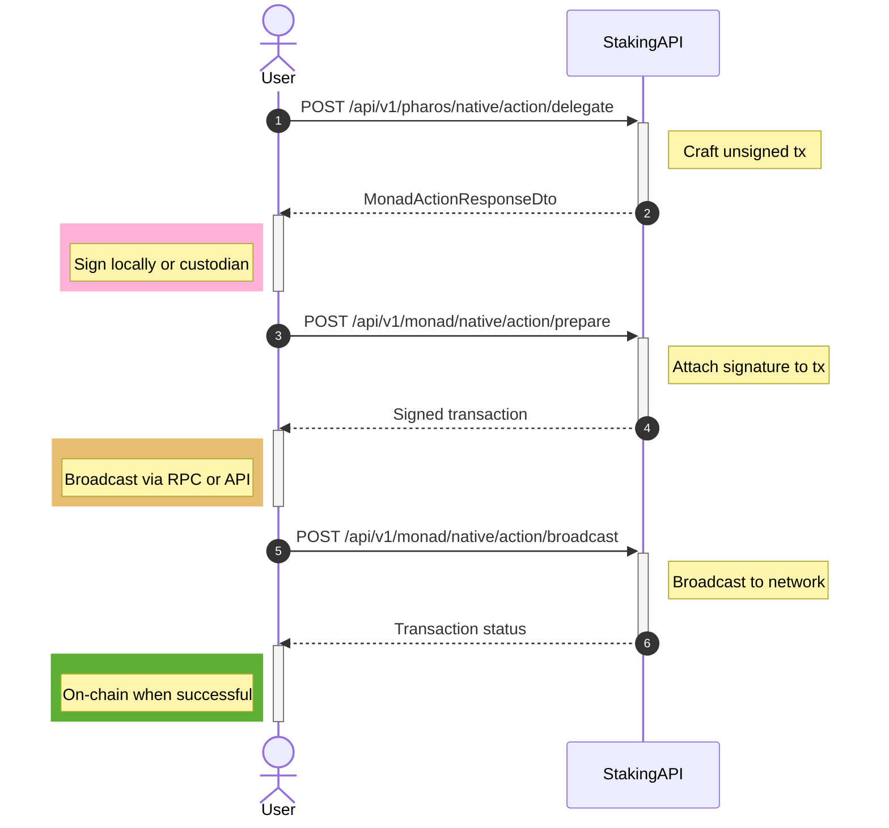

# Staking Flow

Before interacting with the API methods, it is useful to understand how native staking works on Pharos.

Pharos uses an EVM-compatible **delegated staking** model: a delegator assigns native tokens (18 decimals) to a validator pool. The validator participates in consensus; the delegator earns rewards. Delegation, undelegation, reward claims, and withdrawals are executed **on-chain** via the Pharos staking contracts. The Stakely Staking API crafts the required transactions; **signing and broadcasting** are handled by your application.

For protocol-level concepts (delegation lifecycle, pools, and parameters), see the [Pharos delegation documentation](https://silken-muskox-24e.notion.site/Pharos-Delegation-Documentation-3078ec314f7580319e13d4b623e59548).

The default **withdraw window** after undelegation is **84 epochs** (`DEFAULT_WITHDRAW_WINDOW`): principal remains locked for that period before it can be moved to your wallet via the withdraw (`claimStake`) action.

### Delegate

Delegation assigns an amount of native tokens to the validator pool.

1. **Initiate delegation**: Call the delegate action with your wallet `address` and `amount` (in native token units, 18 decimals).
2. **Sign and broadcast**: Sign the returned unsigned transaction, then prepare and broadcast (see [Signing](/staking-api/pharos/signing) and [Endpoints](/staking-api/pharos/native-staking/endpoints)).
3. **Confirmation**: After the transaction confirms, the delegated amount contributes to your active stake (subject to any activation rules on-chain).

### Undelegate

Undelegation starts exiting your **full** effective stake from the pool (the API crafts an undelegate transaction from the delegator `address` only).

1. **Initiate undelegation**: Call the undelegate action with your `address`.
2. **Lock period**: Funds move into the protocol’s pending-unstake / withdraw pipeline. Principal remains subject to the **84-epoch** withdraw window before it becomes withdrawable.
3. **Track state**: Use `GET .../stake-balance/{address}` to read `pendingUnstake`, `pendingWithdrawStake`, and related fields.

### Withdraw

After the unlock period, principal that is no longer locked can be claimed on-chain (`claimStake` in the protocol).

1. **Check availability**: Inspect `pendingWithdrawStake` (and protocol timing) via the stake balance endpoint.
2. **Withdraw**: Call the withdraw action with your `address` to craft the claim transaction.
3. **Post-withdrawal**: Native tokens return to your wallet and can be transferred or redelegated.

### Claim rewards

Rewards accrue separately from principal.

1. **Check rewards**: Use the stake balance endpoint; the `rewards` field reflects claimable rewards.
2. **Claim**: Call the claim-rewards action to craft a transaction that transfers accumulated rewards to your wallet.

### Compound rewards

Rewards can be reinvested into the active stake without a separate wallet transfer.

1. **Compound**: Call the compound-rewards action to craft a transaction that adds claimable rewards back into your delegated position.
2. **Effect**: Your effective stake increases and continues earning according to protocol rules.

___

## Staking API Diagram

