```mermaid
sequenceDiagram
autonumber
actor User
participant Staking API
User->>+Staking API: Create nonce account action
Note left of User: Offline: Create a nonce account
Note right of Staking API: 🔨 Create nonce account action crafting
Staking API-->>-User: Create nonce account action return
activate User
User->>+Staking API: Stake action
Note left of User: Offline: Stake 1 SOL
Note right of Staking API: 🔨 Stake action crafting
Staking API-->>-User: Stake action return
activate User
rect rgb(255,178,216)
Note left of User: 📝 Sign unsigned transaction:
Note left of User:  a) Locally with private key 🔑
Note left of User:  b) Custodian 🏦
end
deactivate User

User->>+Staking API: Prepare
Note right of Staking API: 🔏  Adds signature to tx
Staking API-->>-User: Returns signed transaction
activate User
rect rgba(228, 173, 77, 0.8)
Note left of User: With the signed transaction you can:
Note left of User: Broadcast it by yourself using any RPC
Note left of User: Send it to the broadcast endpoint
end
deactivate User
User->>+Staking API: Broadcast
Note right of Staking API: 📡  Broadcast to the network
Staking API-->>-User: Returns broadcasted transaction status
activate User
rect rgba(50, 156, 0, 0.8)
Note left of User:  If success, transaction is already onchain! 🚀
end
deactivate User
```

# Staking Flow

Before interacting with the API methods, it is useful to understand how staking works conceptually on Solana.

Staking on Solana is account-based. To stake SOL, a dedicated **stake account** is created and delegated to a validator. The stake account holds the delegated SOL and tracks its activation state, rewards, and eventual deactivation.

In most standard integrations, transactions are signed and sent to the network immediately after being created. In these cases, a recent blockhash is sufficient and no additional configuration is required.

However, if a transaction is not going to be signed and broadcast shortly after being created, for example in multisig setups or flows requiring manual approval, a **durable nonce account** must be used. Durable nonce accounts prevent transaction expiration caused by Solana’s short blockhash validity window.

If your integration signs and broadcasts transactions within seconds or a few minutes, the nonce account section can be safely ignored.

### Create nonce account (optional)

1. **Initialize Nonce Account**: A new nonce account is created and initialized with a unique nonce value.

2. **Fund Nonce Account**: The nonce account is funded with a small amount of SOL to cover rent exemption.

3. **Store Authority**: The authority (typically your main wallet) is set for the nonce account, allowing you to use it in future transactions.

The nonce account serves a crucial purpose in transaction durability. Here's why it's important:

- **Overcoming Blockhash Expiry**: Solana transactions typically use a recent blockhash to prevent replay attacks. However, blockhashes expire after a short period (usually about 2 minutes), which can be problematic for transactions that need more time to be signed or processed.

- **Durable Transactions**: By using a nonce account instead of a recent blockhash, you can create transactions that remain valid for an extended period. This is particularly useful for transactions that require multiple signatures or need to be processed at a later time.

- **Improved Reliability**: Nonce accounts allow for more reliable transaction processing, especially in scenarios where network congestion or other factors might delay transaction submission.

:::note
While recent blockhashes are simpler to use, they come with the limitation of a short expiry time. If a transaction using a recent blockhash isn't processed quickly enough, it will fail and need to be recreated with a new blockhash. Nonce accounts eliminate this time pressure, making them ideal for complex or time-sensitive operations like staking.
:::

The Staking API can help you create and manage nonce accounts, simplifying the process of creating durable transactions for your staking operations.

:::info
For more detailed information about durable nonces in Solana, you can refer to the following resources:

- [Solana Official Documentation on Durable Nonces](https://solana.com/developers/courses/offline-transactions/durable-nonces#summary): This resource provides a comprehensive overview of durable nonces, including their purpose, how they work, and their advantages in creating offline transactions.

- [Solana Cookbook: Durable Nonces](https://solanacookbook.com/references/offline-transactions.html#durable-nonce): This guide offers practical examples and explanations on how to use durable nonces in Solana transactions, making it a valuable reference for developers implementing this feature.

These resources can help you gain a deeper understanding of durable nonces and their implementation in Solana's ecosystem.
:::

### Stake (delegation)

Staking in Solana involves creating a stake account and delegating tokens to a validator. Here's an overview of the stake action:

1. **Create Stake Account**: A new stake account is created to hold the tokens you want to stake.

2. **Fund Stake Account**: Transfer SOL tokens from your main wallet to the newly created stake account.

3. **Delegate to Validator**: Choose a validator and delegate your stake account's tokens to them.

4. **Warm-up Period**: There's a warm-up period (several epochs) before your stake becomes active and starts earning rewards.

5. **Earn Rewards**: Once active, your staked tokens contribute to network security and earn rewards. Rewards are automatically reinvested in the staking process.

The stake action combines these steps into a single transaction, simplifying the process for users. When you initiate a stake action through the Staking API, it will craft a transaction that creates the stake account, funds it, and delegates to our validator in one go.

:::note
Remember that while staking, your tokens are locked and cannot be transferred. To unstake, you'll need to go through an undelegation process.
:::

### Unstake (deactivation)

Unstaking in Solana, also known as deactivation, is the process of withdrawing your staked tokens from a validator. Here's an overview of the unstake action:

1. **Initiate Deactivation**: Use the deactivate function to start the process of unstaking your tokens from the validator.

2. **Cooldown Period**: Once deactivation is initiated, there's a cooldown period that typically lasts several epochs (about 2-3 days). During this time, your stake is considered "deactivating" and continues to earn rewards.

3. **Completion of Deactivation**: After the cooldown period, your stake becomes fully deactivated. At this point, it no longer earns rewards and is ready for withdrawal.

The unstake action through the Staking API initiates this process by creating a transaction that deactivates your stake account. It's important to note that this doesn't immediately return your tokens - you'll need to wait for the cooldown period and then perform a separate withdrawal action.

:::note
During the cooldown period, your tokens are still locked and cannot be transferred. Make sure to plan ahead if you need access to your funds, as the process takes several days to complete.
:::

### Withdraw deactivated stake

After your stake has been fully deactivated, you can withdraw the tokens back to your main wallet. This process is called withdrawing deactivated stake. Here's an overview of the withdraw action:

1. **Check Deactivation Status**: Ensure that your stake account has completed the deactivation process and is fully deactivated.

2. **Initiate Withdrawal**: Use the withdraw function to move tokens from the deactivated stake account to your main wallet.

3. **Specify Amount**: You can choose to withdraw a specific amount or the full balance of the stake account.

4. **Transaction Execution**: The withdrawal transaction is executed, transferring the specified amount of SOL from the stake account to your main wallet.

5. **Account Closure (Optional)**: If you withdraw the full balance, the stake account will be automatically closed, and any remaining rent (the minimum balance required to keep an account open) will be returned to your main wallet.

The withdraw action through the Staking API creates a transaction that performs this withdrawal. While it's possible to partially withdraw funds in multiple transactions, the most common approach is to fully withdraw the entire balance in a single transaction.

:::tip
Withdrawing the full balance in one transaction is often more cost-effective, as it allows the stake account to be closed, returning any rent to your wallet.
:::

:::note
Remember that you can only withdraw funds that have been fully deactivated. If you attempt to withdraw before the cooldown period is complete, the transaction will fail.
:::

___

## Staking API Diagram

:::info
The first action "Create nonce account" is not mandatory for the staking flow. However, it is highly recommended to create and use a nonce account for subsequent steps. Using a nonce account allows transactions to be durable over time and not expire, which is particularly beneficial for complex operations like staking.
:::

