# Staking API Diagram

:::info
The first action "Create nonce account" is not mandatory for the staking flow. However, it is highly recommended to create and use a nonce account for subsequent steps. Using a nonce account allows transactions to be durable over time and not expire, which is particularly beneficial for complex operations like staking.
:::

```mermaid
sequenceDiagram
autonumber
actor User
participant Staking API
User->>+Staking API: Create nonce account action
Note left of User: Offline: Create a nonce account
Note right of Staking API: 🔨 Create nonce account action crafting
Staking API-->>-User: Create nonce account action return
activate User
User->>+Staking API: Stake action
Note left of User: Offline: Stake 1 SOL
Note right of Staking API: 🔨 Stake action crafting
Staking API-->>-User: Stake action return
activate User
rect rgb(255,178,216)
Note left of User: 📝 Sign unsigned transaction:
Note left of User:  a) Locally with private key 🔑
Note left of User:  b) Custodian 🏦
end
deactivate User

User->>+Staking API: Prepare
Note right of Staking API: 🔏  Adds signature to tx
Staking API-->>-User: Returns signed transaction
activate User
rect rgba(228, 173, 77, 0.8)
Note left of User: With the signed transaction you can:
Note left of User: Broadcast it by yourself using any RPC
Note left of User: Send it to the broadcast endpoint
end
deactivate User
User->>+Staking API: Broadcast
Note right of Staking API: 📡  Broadcast to the network
Staking API-->>-User: Returns broadcasted transaction status
activate User
rect rgba(50, 156, 0, 0.8)
Note left of User:  If success, transaction is already onchain! 🚀
end
deactivate User
```

