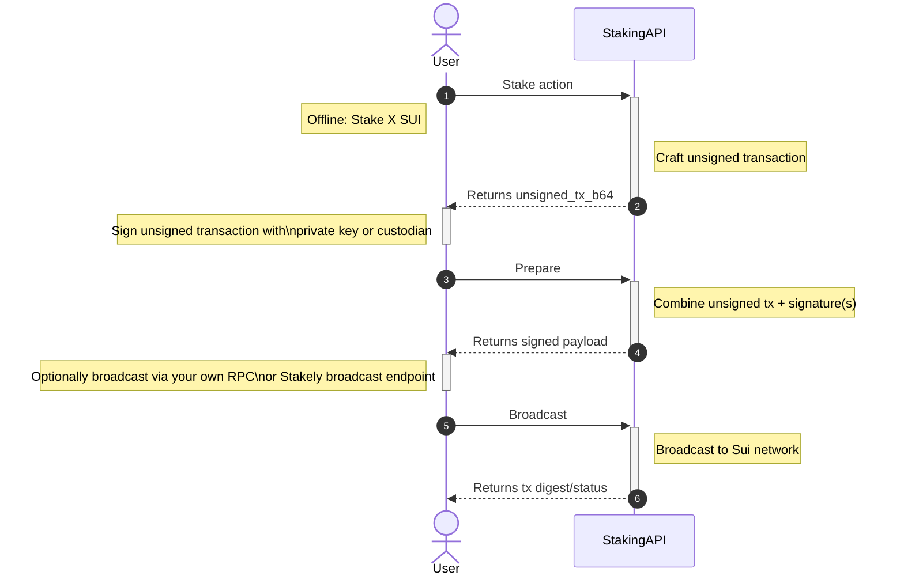

# Staking Flow

Before interacting with the API methods, it is useful to understand how native staking works on Sui.

Sui staking follows an object-based model. A wallet stakes SUI into a validator staking pool and receives stake-related on-chain objects. Unstaking is performed using the specific `StakedSui` object identifier.

All staking operations are executed on-chain. The Stakely Staking API crafts the required transactions, while signing and broadcasting are handled by your application.

### Stake

Staking delegates a specified amount of SUI to a validator.

1. **Initiate Stake**: Use the stake action to create a transaction that stakes a chosen amount to a validator.
2. **Transaction Confirmation**: Once the transaction is confirmed on-chain, your stake position is created.
3. **Stake Objects**: The wallet can then query staked positions and balances.

### Unstake

Unstaking starts the process of withdrawing stake from an existing `StakedSui` object.

1. **Select Staked Object**: Identify the `staked_sui_object_id` to unstake.
2. **Initiate Unstake**: Use the unstake action to craft an unstake transaction.
3. **Transaction Confirmation**: Once confirmed on-chain, the unstake operation is applied.

___

## Staking API Diagram

