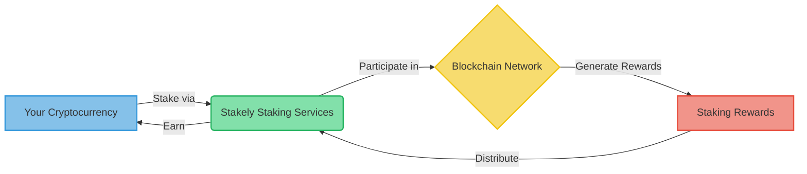
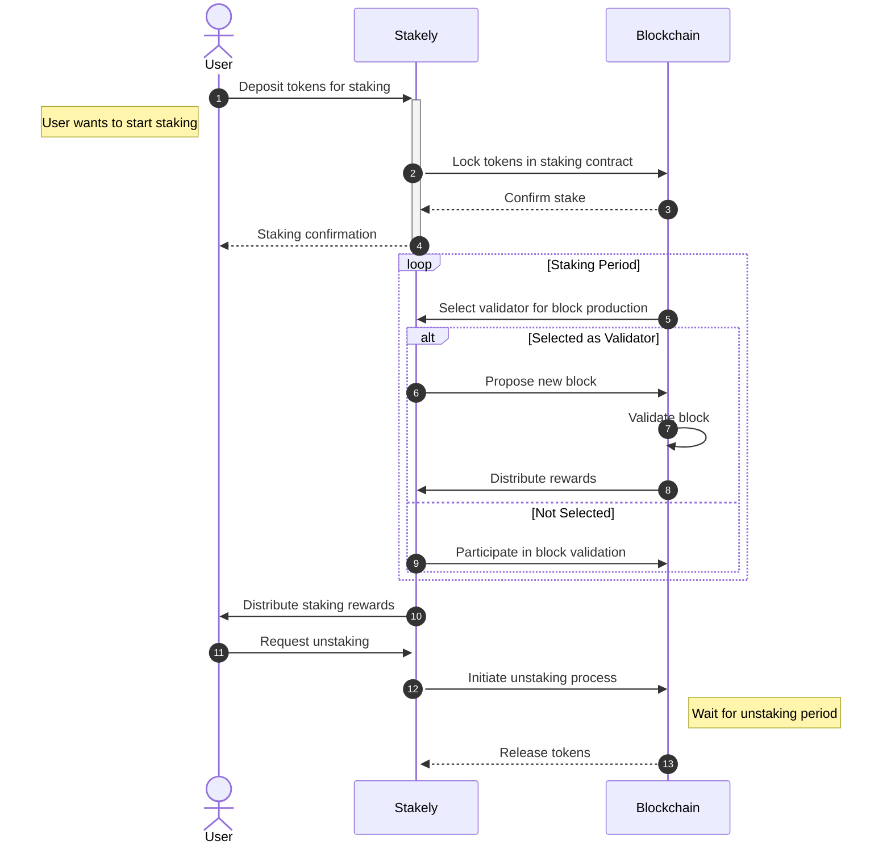

# What is Staking

Staking is a fundamental concept in the world of cryptocurrency and blockchain technology. It offers a way for individuals to participate in network security and earn rewards. Let's explore what staking means from different perspectives.

## Staking for Non-Technical Users

Staking is a way to put your cryptocurrency to work and earn rewards. Think of it as a special kind of savings account for your digital money, but with an important difference: you remain in control of your funds. Here's how it works:

1. **Your Cryptocurrency**: This is your initial investment, the digital coins you own.

2. **Stakely Staking Services**: When you decide to stake, you use a staking provider like Stakely to participate in the staking process. Importantly, we don't take custody of your funds. Instead, we provide the technical infrastructure and expertise to facilitate your staking.

3. **Blockchain Network**: This is the system where your staked cryptocurrency contributes to network operations. It's like a digital economy where transactions happen and new coins are created.

4. **Staking Rewards**: Every blockchain has some incentive from staking in the network, and this incentive can come from network inflation and transaction fees. These rewards are distributed to the stakers of the network.

Here's how the process flows:

- You choose to stake your cryptocurrency using a staking provider like Stakely.
- Your staked cryptocurrency in the staking provider contributes to the blockchain network's operations.
- The network generates rewards for the contributions made.
- These rewards are distributed back to participants.
- You earn your share of these rewards based on how much you've staked.

At Stakely, we handle all the complex parts of this process. You don't need to understand the technical details or manage any equipment. We make it simple to stake your cryptocurrency, while you maintain control and watch your rewards grow over time.

## More In-Depth Explanation of Staking

From a technical perspective, staking is an integral part of Proof of Stake (PoS) consensus mechanisms in blockchain networks. Unlike Proof of Work (PoW) systems that rely on computational power, PoS systems depend on participants locking up their tokens as collateral to validate transactions and create new blocks.

In a PoS system, validators are chosen to create new blocks based on factors such as:
1. The amount of cryptocurrency they have staked
2. The duration of their stake
3. Randomization to ensure fairness

When a validator is selected to forge a new block, they verify transactions, bundle them into a block, and add it to the blockchain. For this service, they receive rewards in the form of transaction fees and newly minted tokens.

Here's a more detailed look at the staking process:

1. **Stake Allocation**: Users lock up a certain amount of tokens in a smart contract or a specialized wallet.

2. **Validator Selection**: The network's algorithm selects validators based on their stake and other factors.

3. **Block Production**: Selected validators create and propose new blocks.

4. **Validation**: Other validators verify the proposed block.

5. **Consensus**: If the majority agrees, the block is added to the chain.

6. **Reward Distribution**: Rewards are distributed to the block producer and sometimes to the validators who participated in the consensus.

Here's a simplified diagram of the staking process:

At Stakely, we abstract much of this complexity away, allowing users to participate in staking without needing to run their own validator nodes. We manage the technical aspects, ensuring optimal performance, security, and maximizing rewards for our users.
